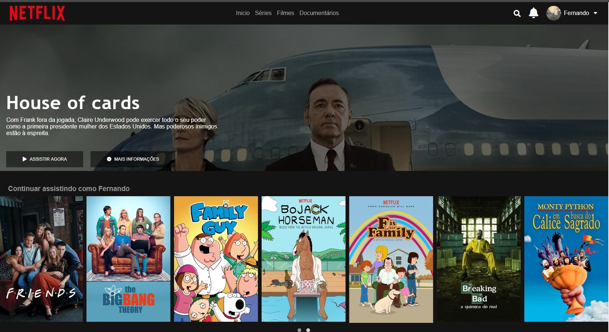

# Recriando-interface-Netflix
Projeto realizado por meio da Digital Innovation One e ministrado por Felipe Aguiar.

Linguagens utilizadas: HTML5, CSS e JavaScript.

Recriando a interface do principal site de streaming mundial utilizando tecnologias simples como HTML5, CSS3 e JavaScript. Nesse projeto foi visto: como estruturar um layout, técnicas de CSS3 com containers e variáveis, como posicionar os elementos com Flexbox e como utilizar plugins Jquery a favor da aplicação.

Nesse projeto inclui alguns elementos como: ícone de usuário, lupa de pesquisa e sino de notificações. Usei um logo mais parecido com o original da Netflix e inclui uma área antes do carrosel dos filmes com a frase: "Continuar assistindo como...."

